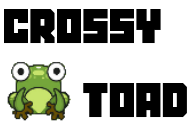
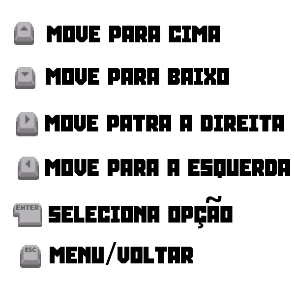

# Crossy Toad

### 
[Installation](/INSTALLATION.md#build) | [TODO List](/TODO.md)

**Crossy Toad é um jogo inspirado no jogo Crossy Road, onde o jogador controla um sapo que tem de atravessar um mapa movimentado, evitando os carros, árvores e outros obstáculos que aparecem no seu caminho. O objetivo do jogo é atravessar a estrada o maior número de vezes possível, sem ser atropelado por nenhum dos carros ou cair num rio. O jogo termina quando o sapo é atropelado por um carro, cai num rio ou fica para trás do mapa caso este não se mova rápido o suficiente.**

***Nota dos desenvolvedores:***
`Existem 4 níveis de dificuldade, sendo que o nível 0 é o mais fácil e o nível 3 é o mais difícil. O deslize do mapa, dado à sua dificuldade, é apenas ativado nos níveis mais elevados, sendo o nivel 2 e nivel 3. O nível 1 é o nível por definido. Para alterar o nível de dificuldade, basta clicar no botão "Selecionar Dificuldade" no menu principal e escolher o nível pretendido.`

`O Jogo conta também com uma função de salvamento, que guada a dificuldade pretendida e o modelo jogador escolhido, bem como o seu melhor score em jogo.`

### Instruções de jogo

## Laboratórios de Informática I
O jogo *Crossy Toad* foi desenvolvido em Haskell, utilizando a biblioteca Gloss para a interface gráfica. O jogo foi desenvolvido no âmbito da unidade curricular Laboratórios de Informática I, do curso de Licenciatura em Engenharia Informática da Universidade do Minho.

#### Known Issues
- O jogo pode não funcionar corretamente no Windows 10, devido a um problema com a biblioteca Gloss. Para corrigir este problema, basta instalar o [Microsoft Visual C++ Redistributable for Visual Studio 2015, 2017 and 2019](https://support.microsoft.com/en-us/help/2977003/the-latest-supported-visual-c-downloads).
- A função de "deslize do jogo" pode por vezes ser muito rápida e não dar tempo ao jogador para reagir.
- Quando o jogador se encontra em cima de um tronco de largura igual a um, pode cair no rio a quando este se movimenta (função de estar parado em cima de um tronco).
## Grupo 9

- **A104365** Fábio Magalhães;
- **A100536** Pedro Rosário;
